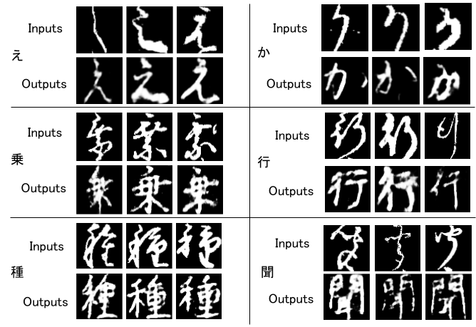

# Generation of Readable Kuzushiji with Keeping the Features of Writing

This is the code of the graduation study in Future University Hakodate. 
Contact me by kyotoor@gmail.com
## Purpose
Kuzushiji is used until Meiji era in Japan. After that, it changed to the character that we are using now. The change is so drastic that many Japanese natives today cannot read Kuzushiji. Along
with that, Kuzushiji recognition applications have been developed. However, many of those use common fonts such as Gothic and Mincho for the outputs of recognition results. The outputs used in those fonts lose the artistry of Kuzushiji in the original documents.
Therefore, we propose a new Kuzushiji generation method that improves readability by transforming each Kuzushiji that appears in the original documents. 



## Overview
Used VAE for generation. In the latent space, move the input by adding the feature vector and decode it. Using Tensorflow.

## Requirements
- Docker engine

## Recommend
- Ubuntu 20.04
- NVIDIA GPU 
- NVIDIA Docker Toolkit

## Project Structure
├── kuzushijiness  
│   ├── README.md  
│   ├── preprocess_etl9b.py  
│   ├── preprocess_kuzushiji.py  
│   ├── requirements.txt  
│   ├── main.ipynb    
│   ├── outputs  
│   │  └── ...  
│   ├── samples  
│   │  └── ...  
│   ├── models  
│   │  └── <span style="color: blue; ">ETL_classification.h5</span>  
│   ├── original_data  
│   │  ├── <span style="color: blue; ">ETL9B.zip</span>  
│   │  ├── <span style="color: blue; ">all.zip</span>  
│   │  ├── <span style="color: blue; ">unpack.zip</span>   
│   ├── processed_data  
│   │  ├── etl9b   
│   │  │  └── ...  
│   │  ├── kuzushiji  
│   │  │  └── ...  

(Blue Texts show things you have to add by the following instructions)

## How to Build
### Build the environment
Install docker image and create the container by the following ways.
```
docker pull tensorflow/tensorflow:2.5.0-gpu-jupyter 
docker create -it -p 10000:8888 --gpus all --name kuzushijiness -v ~/:/tf/ tensorflow/tensorflow:2.5.0-gpu-jupyter
docker start kuzushijiness
docker exec -it kuzushijiness bash
```
Inside the container, install the requirements by the next commands.  
```
apt update
apt upgrade
apt-get install -y libgl1-mesa-dev
pip3 install -r requirements.txt
```
### Preprocess of modern Japanese character dataset
Registrate and Get the ETL9B dataset from this link
http://etlcdb.db.aist.go.jp/download-request  
Place it like this. ./original_dataset/ETL9B.zip  
Get the sample script(unpack.zip) from http://etlcdb.db.aist.go.jp/file-formats-and-sample-unpacking-code.   
Move it to the place showed in the Project Structure.  
Then Run the next. (First you need to change the direction(cd) to the appropriate direction, kuzushijiness/)
```
unzip ./original_data/unpack.zip -d ./
unzip ./original_data/ETL9B.zip -d ./original_data/
python3 unpack.py ./original_data/ETL9B/ETL9B_1
python3 unpack.py ./original_data/ETL9B/ETL9B_2
python3 unpack.py ./original_data/ETL9B/ETL9B_3
python3 unpack.py ./original_data/ETL9B/ETL9B_4
python3 unpack.py ./original_data/ETL9B/ETL9B_5
```
### Proprocess of Kuzushiji dataset
Get Kuzushiji Dataset from this site
http://codh.rois.ac.jp/char-shape/book/100241706/  
Download all.zip 
くずし字データセットダウンロード：全体（ZIP 7032.01MB）  
Place it like this ./original_data/all.zip  
Then Run the next.
```
unzip ./original_data/all.zip -d ./original_data/all/
unzip -q './original_data/all/*' -d ./original_data/all/
python3 preprocess_kuzushiji.py
```
### Get the trained Model
This model is not for generation. This is just for recognition.  
Download from this link. https://drive.google.com/drive/folders/1LRAwyvboDnbLZOm8Aw0nZPP7w_BG3dD7?usp=sharing  
Place it to ./models/ETL_classification.h5


### Run
Open the jupyter notebook on the browser. 
```
jupyter notebook list
```
Get the token and run the code on your browser.
## Acknowledgement
I appericiate Center for Open Data in the Humanities(CODH).  
Also thank you to keras and jupyter community. 